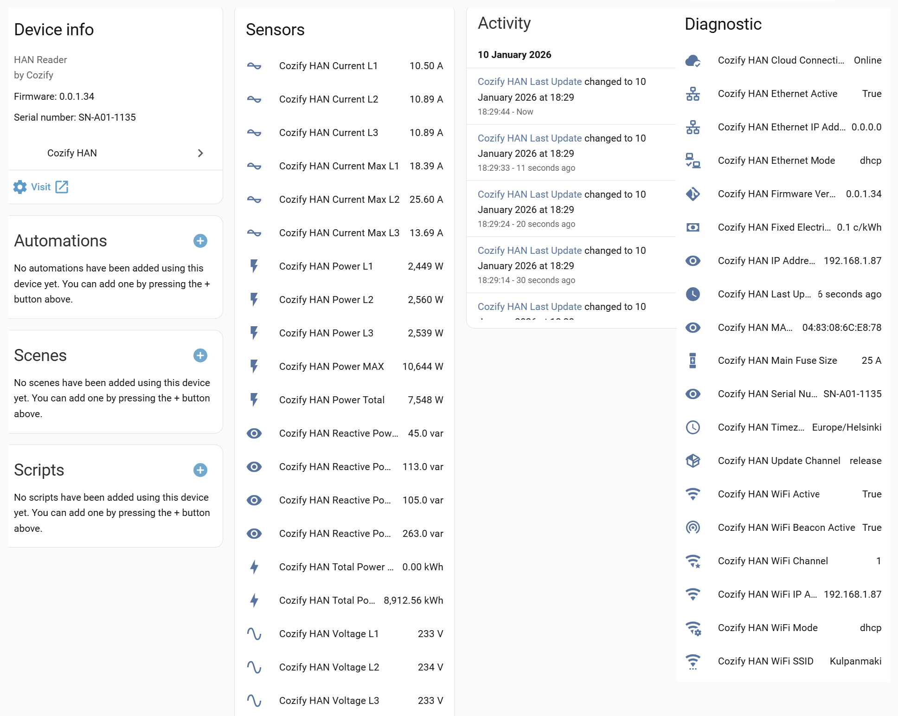

# Cozify HAN for Home Assistant

Custom integration for Home Assistant to fetch real-time energy data from the Cozify HAN (HAN/P1 meter).

## Features

- **Real-time Power:** Total and phase-specific (L1, L2, L3) power consumption.
- **Voltage & Current:** Per-phase monitoring.
- **Reactive Power:** Support for reactive power monitoring (VAr).
- **Energy Statistics:** Total imported and exported energy for Home Assistant Energy Dashboard.

## Installation

### Via HACS (Custom Repository)

1. Open Home Assistant and go to HACS -> Integrations.
2. Click the three dots in the upper right corner and select Custom repositories.
3. Add the address of this repository: <https://github.com/cozify/han-home-assistant>
4. Select Integration as the category and click Add.
5. Find "Cozify HAN" in the list and click Download.
6. Restart Home Assistant.

### Step 2: Enable integration

1. Go to Settings -> Devices and services.
2. Click Add integration.
3. Search for "Cozify HAN".
4. Enter the IP address of your device (e.g. 192.168.1.10) and click Submit.

## Electricity Price Tracking (Example)

You can use the `sensor.cozify_han_power_total` sensor created by the integration to calculate the electricity price in real time. We recommend using the **Riemann sum integral** sensor to convert the instantaneous price (c/h) into cumulative consumption (c), which you can track with **Utility Meter** on a daily, weekly, and monthly basis.

## Automation - Blueprints

- Download via Home AUtomation Settings - Automation & scenes - Blueprints - Import Blueprint - "Enter the following address"

- Blueprint base for automation that warns when any phase exceeds the specified current limit. <https://github.com/cozify/han-home-assistant/blob/main/blueprints/overcurrent_notification.yaml>
- Blueprint base for automation that warns when any phase exceeds the specified power limit. <https://github.com/cozify/han-home-assistant/blob/main/blueprints/total_power_notification.yaml>

## Cozify HAN

Cozify HAN is a Nordic, Finnish key-flag product that brings real-time data from the electricity meter's HAN/P1 interface to the local network, cloud and smart systems. It is designed specifically for northern conditions, easy self-installation and extensive integration (RestAPI, MQTT and Modbus) for energy optimization, load management and automation.

### Key features

- Real-time measurement data: instantaneous power (W/kW), voltage (V), current (A) and cumulative consumption figures (kWh) per phase, all data coming from the HAN/P1 bus

- Supports Ethernet (RJ45) and WiFi connection; possibility to replace the original antenna with an RP-SMA external antenna for better range
- Built-in HTTP OpenAPI server (/meter), MQTT broadcast and Modbus (TCP) interfaces for B2B integrations
- Works with Android and iOS applications, OTA firmware updates ensure further development and security
- Designed to operate in Nordic conditions –40 °C … +60 °C and with the same IP rating as the electricity meter

### What the device offers to the user

- Accurate real-time visibility into electricity consumption and production

- Phase-specific load views make it easy to identify overload risks and balance loads
- Better opportunity to utilize hourly and quarter-hourly prices and real-time control in smart charging and heating
- Integrates with existing home automation platforms (e.g. Home Assistant) and energy management systems (EVCC.io, etc.). Integration possibilities are limitless via Modbus (TCP), MQTT and RestAPI interfaces. More interfaces in the future.

### Technical data

- Connections: RJ12 (HAN/P1), RJ45 (Ethernet), WiFi , USB‑C (additional power), RP-SMA (additional WiFi antenna)

- Interfaces: OpenAPI (HTTP, /meter), MQTT (JSON‑payload), Modbus TCP (registers)
- Operating environment: −40 °C … +60 °C; housing and connections according to electricity meter class

### Installation and commissioning

- Self-installation; placed next to the electricity meter and attached with e.g. double-sided tape

- If the meter is in a metal cabinet, an Ethernet connection or an external RP-SMA antenna is recommended to ensure a reliable connection.

### Development and Support

This is a community-driven integration. If you find any bugs or want to improve it further, please create an "Issue" on GitHub.

---
*Note: This integration is officially supported by Cozify Oy.*
